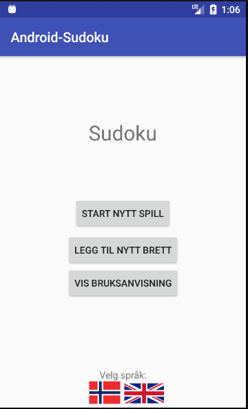

# Android-Sudoku
Android sudoku app made in java with Android Studio.

## Screenshots (***MORE COMING SOON***)

## Features
  - Start a new game with a specified difficulty:
    * Easy
    * Normal
    * Hard
  - Add new Sudoku boards (boards are added to internal storage on the device)
  - Mark a placed piece as unsure (the piece will have a light blue background)
  - Instructions of how to play
  - Choose language at the start screen

## Credits
Flag images are from [flaglane.com](http://flaglane.com/).
  - Norwegian flag: [here](http://flaglane.com/download/norwegian-flag/norwegian-flag-small.png)
  - British flag: [here](http://flaglane.com/download/british-flag/british-flag-small.png)

## License
MIT © [Knut Kirkhorn](LICENSE)
